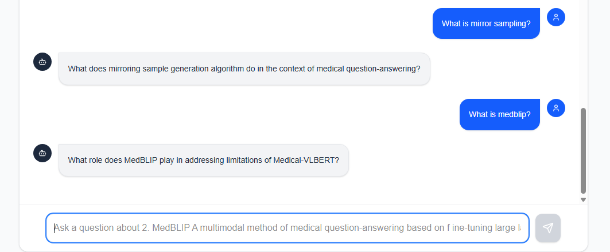

# 🦉 Socratic Tutor: AI That Teaches, Don't Just Answer

   


> A Hybrid AI application that combines **RAG (Retrieval Augmented Generation)** for factual accuracy with **LoRA (Low-Rank Adaptation)** for behavioral fine-tuning.

Most AI bots act like search engines—they give you the answer immediately. **Socratic Tutor** is different. It uses a custom fine-tuned Llama 3 model to guide users to the answer using the Socratic Method, ensuring they actually learn the material uploaded in their textbooks.

---

## 🌟 Key Features

- **🧠 Behavioral Fine-Tuning (LoRA):** The model runs on a custom adapter trained via **Unsloth** to suppress direct answers and generate guiding questions instead.
- **📚 RAG Knowledge Base:** Users can upload specific PDF textbooks. The AI retrieves context _only_ from that book to ensure factual grounding.
- **⚡ Hybrid Architecture:** Separation of concerns—**MongoDB** handles the "Knowledge" (Facts), and **LoRA** handles the "Personality" (Teaching Style).
- **🔍 Vector Search:** Built with **MongoDB Atlas Vector Search** using `nomic-embed-text` embeddings for high-accuracy retrieval.
- **🔒 Local Privacy:** Runs inference locally using **Ollama**, ensuring textbook data stays private.

---

## 🏗️ Technical Architecture

This project solves the "Hallucination vs. Style" problem in Generative AI.

1.  **Ingestion Pipeline:**
    - User uploads PDF -> Parsed by `LangChain` -> Chunked -> Embedded via `nomic-embed-text` -> Stored in `MongoDB Atlas`.
2.  **Inference Pipeline:**
    - User asks question -> System searches MongoDB for relevant context (RAG).
    - System constructs a prompt: `System Instruction` + `Retrieved Context` + `User Question`.
    - **Ollama** runs the prompt through **Llama-3-8B** + **Custom Socratic LoRA Adapter**.
    - Response is streamed back via **Vercel AI SDK**.

### Tech Stack

- **Frontend:** Next.js 14 (App Router), Tailwind CSS, Lucide React.
- **AI Orchestration:** LangChain.js, Vercel AI SDK (3.2+).
- **Database:** MongoDB Atlas (Vector Search).
- **Fine-Tuning:** Pytorch used to generate the GGUF adapter.

---

## 🚀 Getting Started

### Prerequisites

- Node.js 18+
- [Ollama](https://ollama.com) installed locally.
- A MongoDB Atlas account (Free tier works).

### 1. Clone & Install

```bash
git clone https://github.com/lwq246/socratic-tutor.git
cd socratic-tutor
npm install
```
